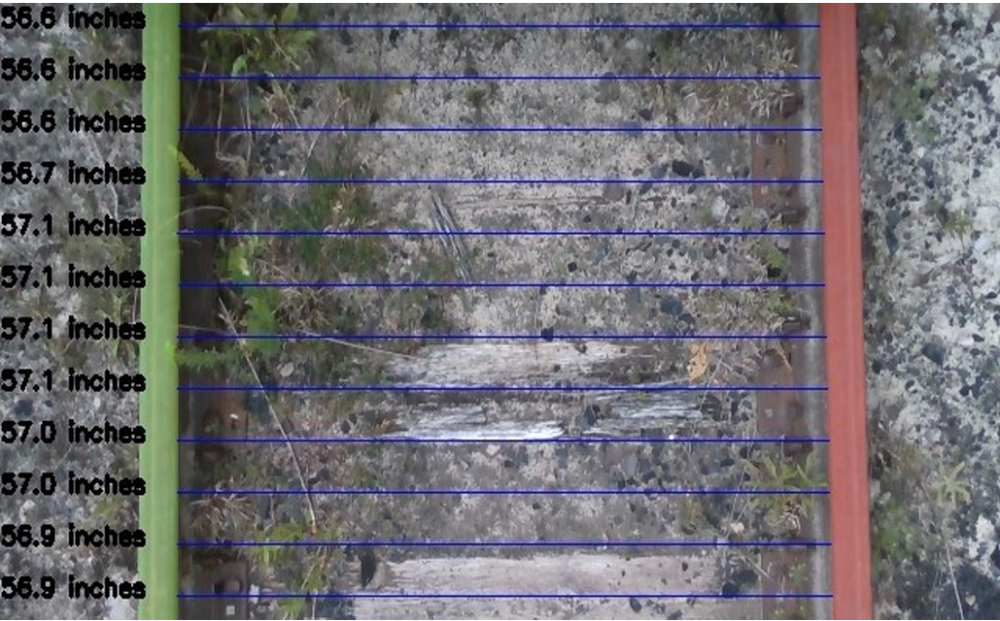
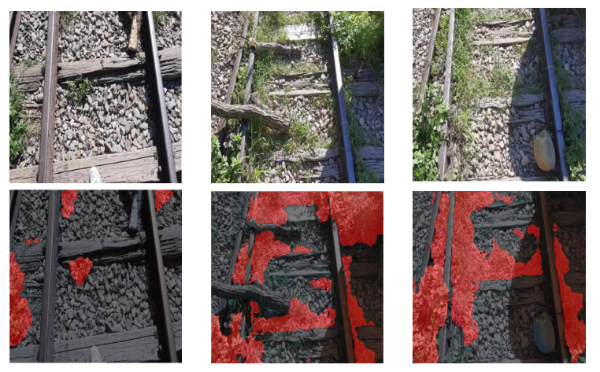

  
  

# Railroad Gauge Detection with Depth Sensors and Machine Learning

This repository contains code for measuring **horizontal gauge deviation in railroad tracks** using **depth camera data** and **machine learning-based segmentation**. It includes custom modifications to the **SAMURAI** segmentation model, data preprocessing tools, and a full measurement pipeline.

---

## 🔧 Features

- **Modified SAMURAI Segmentation** [Original Version can be found at https://github.com/yangchris11/samurai]:
  - Releases out-of-range tracking frames in `sam2_video_predictor.py`
  - Adds return of candidate masks and their scores in `misc.py` and `sam2_base.py`
  
- **Gauge Deviation Detection**:
  - 3D distance measurement between rail tracks using depth data and segmentation masks

- **Data Preprocessing Tools**:
  - `extract_data_folder.py`: Extracts RGB and depth frames from `.bag` files
  - Custom denoising process to handle vegetation, motion blur, and depth noise

---

## 📂 File Overview

| File / Folder | Description |
|---------------|-------------|
| `/samurai/scripts/horizontal_deviation.py` | Core script for gauge deviation measurement |
| `samurai_testing.ipynb` | Google Colab/Jupyter notebook demo for using the pipeline |
| `extract_data_folder.py` | Extracts RGB and depth frames from Intel RealSense `.bag` files |
| `vegetation_detecion.ipynb` | Training Script of Deeplabv3+ for vegetation detection |

---

## 📌 Usage

1. **Data Extraction**:
   Modify `extract_data_folder.py` to extract RGB/depth images from a `.bag` recording for SAMURAI input.

2. **Gauge Deviation Detection**:
   Use `samurai_testing.ipynb` to process the extracted data using the modified SAMURAI and calculate gauge deviation. It demonstrates how to call `horizontal_deviation.py`.
